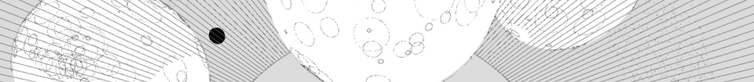

# clj-org

A (partial) Org Mode parser in Clojure.

This library parses Emacs [Org Mode](http://orgmode.org/) format to
[Hiccup](https://github.com/weavejester/hiccup), which is a tree
representation of HTML in the form of nested Clojure vectors.

## Getting Started

Add the above dependency to `project.clj`.  Use
`clj-org.org/parse-org` to convert a string of Org Mode text into
Hiccup.

## Implementation

Factored out of the [blorg](https://github.com/eigenhombre/blorg) blog
prototype, this parser started out as an
[Instaparse](https://github.com/Engelberg/instaparse) grammar.
However, it proved too difficult to get good performance without
ambiguities, so the parser has become what is basically a series of
monster regular expressions ([example
here](https://github.com/eigenhombre/clj-org/blob/master/src/clj_org/org.clj#L361)).

## Example

    (ns myproject.core
      (:require [clj-org.org :refer [parse-org]]))
    
    (parse-org "#+TITLE: This is an Org Mode file.

    * This is the outer section
    ** This is an inner section
    Inner section body -- /with italic text/!  And *bold text* too.

    - Plain List Item 1
    - Plain List Item 2
    [[http://eigenhombre.com][A link to a Web site]]
    ")

... yields:

    {:title "This is an Org Mode file.",
     :headers "\n#+TITLE: This is an Org Mode file.\n\n",
     :content
     [:div
      [:h1 [:p "This is the outer section"]]
      [:h2 [:p "This is an inner section"]]
      [:span
       [:p
	[:span
	 [:span
	  "Inner section body &#x2013; "
	  [:em "with italic text"]
	  "!  And "]
	 [:strong "bold text"]
	 " too.\n"]]
       [:ul
	[:li [:p "Plain List Item 1\n"]]
	[:li [:p "Plain List Item 2\n"]]]
       [:p
	[:span
	 [:a {:href "http://eigenhombre.com"} "A link to a Web site"]
	 "\n"]]]]}

## License

Copyright © 2015 John Jacobsen. MIT license.

## Disclaimer

THE SOFTWARE IS PROVIDED "AS IS", WITHOUT WARRANTY OF ANY KIND, EXPRESS OR
IMPLIED, INCLUDING BUT NOT LIMITED TO THE WARRANTIES OF MERCHANTABILITY,
FITNESS FOR A PARTICULAR PURPOSE AND NONINFRINGEMENT. IN NO EVENT SHALL THE
AUTHORS OR COPYRIGHT HOLDERS BE LIABLE FOR ANY CLAIM, DAMAGES OR OTHER
LIABILITY, WHETHER IN AN ACTION OF CONTRACT, TORT OR OTHERWISE, ARISING FROM,
OUT OF OR IN CONNECTION WITH THE SOFTWARE OR THE USE OR OTHER DEALINGS IN THE
SOFTWARE.
